# whichboot.gb

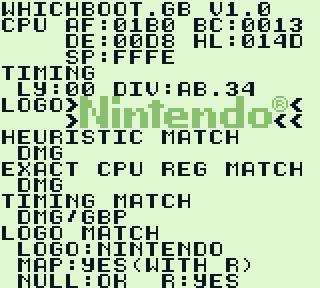 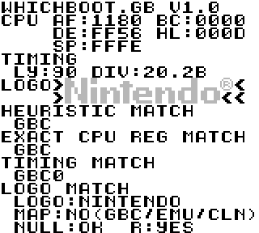

Whichboot.gb is a research tool for identifying Gameboy consoles and emulators through software running on the machine/emulator. It is similar in concept to [Matt Currie's which.gb](https://github.com/mattcurrie/which.gb) but it's using different detection mechanisms and is geared toward detecting different aspects of the running machine than which.gb. Whereas which.gb is trying to detect which SoC revision the ROM is running on by triggering various hardware quirks, whichboot.gb is trying to detect which boot ROM was executed. It does this by detecting the CPU register values left by the boot ROM, as well as the timing of the boot process using `DIV` and `LY`, and the logo data left in VRAM. 

The initial purpose of this tool was to provide a non-intrusive way of detecting any undumped boot ROMs that may exist in Gameboy clones. However, it also turned out to be a powerful tool for finding out interesting information about the design process and internal workings of various emulators. I have run whichboot.gb on a wide range of new and old emulators, and using just the methods described below, it can accurately detect many of the older emulators exactly.

## Call to action: Gameboy clone owners

If you are a collector who owns some of the older GB clones, it would be interesting if you could run this ROM on those and document the result. Even if it turns your particular clone has a known boot ROM version, it would help establish a lineage of which boot ROM versions where used in which versions of the clones.

These are the names of a few of the clones that exist:

- Game Fighter
- Fortune SY-3000B
- Fortune SY-3000G
- Bitman 3000B
- Walk Game II
- KF2000
- KF2002
- GB-01
- GB Boy
- SuperBeautiful
- Mega Game
- Crazy Boy
- Cool Boy
- GB Boy
- GB Boy Colour

## Building

Prerequisite: some recent version of RGBDS. Under Linux and presumably macOS, just run `./m.sh`. No Makefile, sorry. Under Windows it should not be too hard to make a `m.bat` file that executes the same commands as `./m.sh`.

## Version history

### Version 1.0

- Initial release.

### Version 1.1

- Added support for using `$0000` as an entry point. Intended for use with entering GBA-GBC mode with boot ROM skip.
- Added specific detection for a bunch more emulators from the [GB Emulator Shootout](https://daid.github.io/GBEmulatorShootout/).

## Detection mechanisms

This is a description of the various detection mechanism used by whichboot.gb.

### Heuristic match

This is a simple, non-exhaustive matching algorithm which is meant to represent what a typical game would detect. For example, if the heuristic match says GBC or GBA, it's likely that a typical dual platform game would run in GBC mode. If the heuristic match says GBA, some games will load a brighter palette to compensate for the GBA's darker display.

This algorithm also tries to detect Super Gameboy through the recommended method of reading the joypad in multiplayer mode. Some emulators have a special configuration known as GBC+SGB or similar, which allows the game to set a SGB border etc even though the emulated machine is a Gameboy Color. Whichboot.gb can detect this mode as well.

This field can also say "entry point 0", which means whichboot.gb started running from the entry point $0000. This can for example happen if you run it on a GBA with boot ROM skip, or in Emulicious with "no boot ROM" selected as the boot ROM under options, emulation.

### CPU registers

Whichboot.gb saves all CPU registers on startup and compares them to a reference list for an exact match. The values of the CPU registers depends on the actions of the boot ROM, or in the case of an emulator without boot ROM emulation, what the registers were set to by the emulator.

### Timing match

Whichboot.gb tries to measure the time since the last reset using the `DIV` register, which is somewhat similar to the TSC (timestamp counter) in modern CPUs.

However, since it overflows every 15.625 ms (or at a rate of 64 Hz) it can't reliably log the time since boot in absolute terms. However, it's still useful as a "fingerprint" of the time taken even.

It counts up at a rate of 16384 Hz, which is way slower than the CPU frequency. (1 tick every 64 M cycles, where 1 M cycles is equivalent to 4 T cycles.) Whichboot.gb also tries to detect the hidden bits of DIV by detecting when it changes, which gives an additional fine timer value in the range `0-$3F`, or 6 additional bits of fingerprinting.

### Logo match

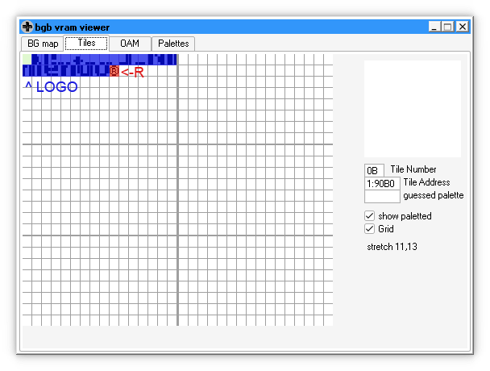

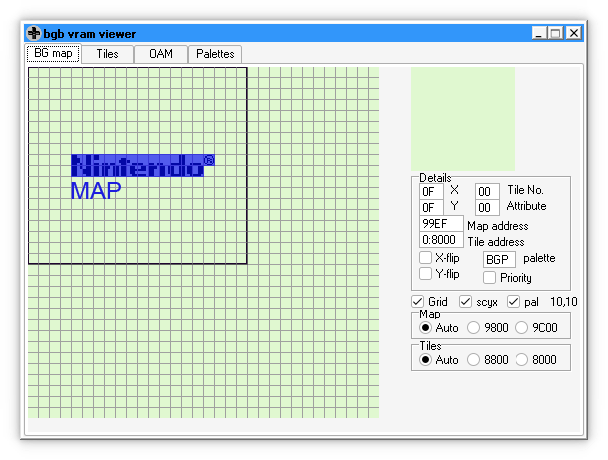

A custom boot ROM may copy some other graphical data to VRAM instead of the logo present on the cartridge. This is for example the case with the Gameboy clone called MaxStation which has identical initial CPU registers and timing as the DMG boot ROM, but is detectable through the VRAM contents. Many (older) emulators don't write any data at all to VRAM.

Specifically, this test checks the following things, also indicated in the screenshots above.

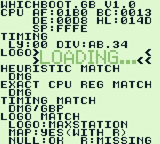

**Logo:** Checks for the existence of a logo in tile RAM in the area `$8010-$819F`, aka tiles `$01-$18`. It has the following possible values:
- **No logo.** The logo tile area was filled with null bytes, indicating no logo graphic was copied there. This is common for many emulators, as well as for the Game Fighter version of the boot ROM, which boots immediately without showing a logo on screen. All official boot ROMs will put a copy of the logo here, including SGB.
- **Nintendo.** The standard Nintendo logo graphic was put into tile RAM. This would be expected on any hardware (except as mentioned, Game Figher and Maxstation.) unless a logo swap technique was used.
- **Maxstation.** The Maxstation clone ignores the logo graphics present in the cartridge header, and always copies a "Loading..." graphic into tile RAM from the boot ROM itself.
- **Unknown.** Some unknown graphic was put into tile RAM. You can see what was found in the logo display. This could indicate a yet so far undumped boot ROM.

**Map:** Checks for the existence of a logo and ® symbol in the BG MAP, in the areas `$9904-$9910` and `$9924-$992F`. It has the following possible values:
- **No (GBC/emu/clone).** The logo area of the BG map was empty. This is common on many emulators. This is also normal on GBC, which doesn't fill it in, except for when running two particular hardcoded games. This is also true for the Game Fighter version of the boot ROM, which boots immediately without showing a logo on screen.
- **Yes (with ®).** This is the expected value on most DMGs, all GB Pockets and all SGB. It's also expected on Maxstation. (Even though Maxstation doesn't put any graphic in the tile that usually contains the ®, it does initialize it in the BG map.)
- **Yes (no ®).** This is the expected value for the very early DMG0 boot ROM revision which, lacks the ® symbol completely.

**R:** Check for the existence of the ® symbol in tile RAM in the area `$8190-$819F` aka tile `$19`.
- **Missing.** This area was filled with null bytes. This is expected on DMG0, Maxstation, and anything that doesn't put ahything at all in VRAM like Game Fighter and many emulators.
- **Yes.** The ® symbol exists in tile `$19`.
- **Unknown.** Some unknown graphical data was put into tile `$19`. You can see what was found in the logo display. This could indicate an undumped boot ROM.

**Null:** Checks whether all bytes of VRAM that were not checked above are `$00`. This is expected to literally always be true, except if whichboot.gb was started through a warm reboot, or if the boot ROM did something wild. This was actually the case for an older version of SameBoot shipped with SameBoy 0.13.
- **Ok.** All checked bytes were `$00`.
- **Unk(nown).** Not all checked bytes were `$00`.

## Acknowledgements

I wish to thank beware for making [BGB](https://bgb.bircd.org/), which was useful in debugging this, and every other, Gameboy project I make. I also wish to thank bbbbbr for [dumping the boot ROM of the MaxStation GB clone](https://twitter.com/0xbbbbbr/status/1568132567018389510), which prompted the last minute addition of the logo match check.

## Reference values for hardware

These are the reference values for the boot ROMs variations (official and bootleg) that are detectable by whichboot.gb, with some notes for each.

### DMG0

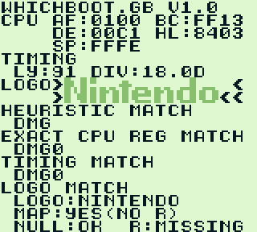

```
Initial CPU registers:
AF:0100 BC:FF13
DE:00C1 HL:8403
SP:FFFE

Timing:
LY:91 DIV:18.0D
```

The very first known version of the DMG SoC and boot ROM. Probably only found in units with serial number below G1000000 or thereabout, and probably only ever sold in Japan. Notably, this version of the boot ROM is missing the ® symbol to the right of the logo, and will flash the whole screen if the logo/header data is invalid instead of scrolling down the whatever was read from the cartridge and then locking up. The main revision of the DMG boot ROM went through some major overhaul so the initial registers and timings are pretty different between them. 

### DMG


```
Initial CPU registers:
AF:01B0 BC:0013
DE:00D8 HL:014D
SP:FFFE

Timing:
LY:00 DIV:AB.34
```

The mainline revision of the DMG boot ROM. 

### Gameboy Pocket

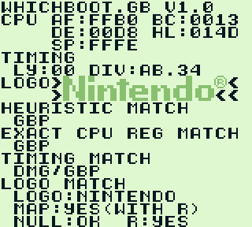

```
Initial CPU registers:
AF:FFB0 BC:0013
DE:00D8 HL:014D
SP:FFFE

Timing:
LY:00 DIV:AB.34
```

Almost identical to the mainline DMG bootstrap except for one byte near the end. 
```
ld  A,$01
ldh [$FF50], A  ; Boot ROM lockout register
```
...was replaced with...
```
ld  A,$FF
ldh [$FF50], A  ; Boot ROM lockout register
```
...specifically to allow Gameboy Pocket to be detected by the game. The lockout register only cares that bit 0 is set, so this still works form that point of view.

### Super Gameboy

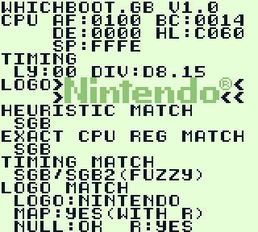

```
Initial CPU registers:
AF:0100 BC:0014
DE:0000 HL:C060
SP:FFFE

Timing:
LY:00 DIV:D8.12-D8.19
```

The Super Gameboy boot ROM is notable for not actually having any logo/checksum lockout functionality. Instead, it transfers the full header to the SNES, and lets it take the decision whether to allow the game to boot. 

Because the boot ROM's data transfer code takes a different amount of time to transfer a set and a cleared bit, there's some variation in the measured timing value depending on the exact contents of the ROM header. A limitation of the current version of whichboot.gb is that it only checks whether the value is within the valid range for SGB. A better test would calculate the exact expected timings from the ROM header and only match SGB for that exact value.

### Super Gameboy 2

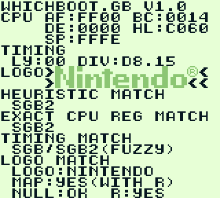

```
Initial CPU registers:
AF:FF00 BC:0014
DE:0000 HL:C060
SP:FFFE

Timing:
LY:00 DIV:D8.12-D8.19
```

Just like Gameboy Pocket boot ROM, this is just a one byte change that sets `A=$FF` to allow detection. This is used by Tetris DX to display a different SGB border depending on the SGB revision.

### Gameboy Color (GBC0)


```
Initial CPU registers:
AF:1180 BC:0000
DE:FF56 HL:000D
SP:FFFE

Timing:
LY:90 DIV:20.2B
```

Just like with DMG, Gameboy Color was found to have an early SoC and boot ROM revision, which is relatively rare. 

### Gameboy Color (mainline boot ROM version)


```
Initial CPU registers:
AF:1180 BC:0000
DE:FF56 HL:000D
SP:FFFE

Timing:
LY:90 DIV:1E.28
```

This is the mainline revision, found in the vast majority of GBCs. The boot ROM was changed to clear audio channel 3's wave RAM. This is a software fix for R-Type, which is missing audio channel 3 on the title screen unless wave RAM is initialized with an audible waveform. (Pre-GBC hardware would have random data in wave RAM which would produce a sound, whereas GBC has all zeroes at reset.) They also differ in a couple of other minor ways.

The initial CPU registers are identical between the GBC0 and GBC revisions of the boot ROM, but can be detected using timing (like whichboot.gb does) or by inspecting wave RAM on boot.

### Gameboy Advance

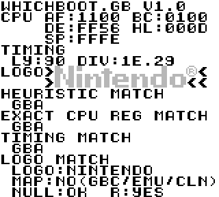

```
Initial CPU registers:
AF:1180 BC:0100
DE:FF56 HL:000D
SP:FFFE

Timing:
LY:90 DIV:1E.29
```

The GBA's GBC mode differs by setting `B=$01`. This is intended for identifying GBA so that the game can compensate for the GBA's darker LCD screen. It also takes one M cycle longer to boot.

The GBA has two different known revisions, of which one fixes the TOCTTOU vulnerability that allows the Nintendo logo to be swapped using special hardware. However, the difference between these two revisions can't be detected using the methods that whichboot.gb is using. Detection would require either running a game that does logo swap and see if the logo swap was successful, or monitoring the bus activity using a logic analyzer or similar tool.

### Game Fighter (Clone)

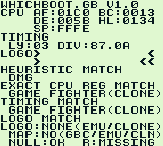

```
Initial CPU registers:
AF:01C0 BC:0013
DE:005B HL:0134
SP:FFFE

Timing:
LY:03 DIV:87.0A
```

The first Gameboy clone boot ROM I personally dumped. I'm calling this boot ROM variant Game Fighter after the device it was dumped from, but in reality the same boot ROM might exist on other clone devices as well.

This one boots right into the game, and doesn't show any graphics or play any sound. It doesn't check the checksum and only checks the second half the logo. However, one interesting thing about this boot ROM is that it checks against both the Nintendo, and some unknown logo. We can reconstruct the bottom half of from the data in the boot ROM. You can read more about this on my blog: [Dumping the boot ROM of the Gameboy clone Game Fighter](https://blog.gg8.se/wordpress/2014/12/09/dumping-the-boot-rom-of-the-gameboy-clone-game-fighter/)

Another interesting thing is that `B` CPU register is never used, which preserves whatever value it was at boot, which seems to always be 0.

### Fortune SY-3000B (Clone)

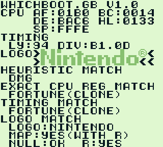

```
Initial CPU registers:
AF:01B0 BC:0014
DE:BAC6 HL:0133
SP:FFFE

Timing:
LY:94 DIV:B1.0D
```

The second Gameboy clone boot ROM I personally dumped. I'm calling this boot ROM variant Fortune after the device it was dumped from, but in reality the same boot ROM might exist on other clone devices as well. 

This boot ROM does show the Nintendo logo, but without any animation, and plays a single note chime.

### GB Boy (Clone)

```
Initial CPU registers:
AF:01B0 BC:0013
DE:00D8 HL:014D
SP:FFFE

Timing:
LY:00 DIV:AB.34
```

The monochrome GB Boy, also sometimes referred to as the GB Boy Pocket due to its similarity to the Gameboy Pocket, has a custom boot logo that say SGM. Due to this, you might be lead to believe that it has a custom boot ROM. But in fact, it has a stock DMG boot ROM, and thus identical initial values. Instead, it does graphical replacement on the data that comes out of the PPU. Thus, it's undetectable using any method used by whichboot.gb and detects as a DMG.

### GB Boy Colour (Clone)

```
Initial CPU registers:
AF:1180 BC:0000
DE:FF56 HL:000D
SP:FFFE

Timing:
LY:90 DIV:1E.28
```

The GB Boy Colour has replaced the Gameboy logo with a GB Boy logo, and has also doesn't show the Nintendo logo from the cartridge. This is done using a modified boot ROM, however the execution path is cycle for cycle identical and the initial CPU registers are identical as well, so whichboot.gb's tests are detecting it as a mainline GBC. Both the GB Boy and GB Boy Colour can be detected through glitches, as shown in [jbshelton's fork of which.gb](https://github.com/jbshelton/which.gb). However, such detection methods are outside the scope of whichboot.gb.

### Maxstation (clone)


```
Initial CPU registers:
AF:01B0 BC:0013
DE:00D8 HL:014D
SP:FFFE

Timing:
LY:00 DIV:AB.34
```

The Maxstation has the boot logo replaced with "Loading..." which is done with a modified DMG boot ROM. The boot ROM's execution path is cycle for cycle identical to that of DMG, however it can be detected by looking for the "Loading..." graphics left in VRAM. Because it's similar to the DMG boot ROM, it does run the code that shows the ® symbol, only that the tile data for the ® has been blanked out so that it copies null bytes into VRAM instead.

## Notes on various emulators

These are some notes of things I've discovered about various emulators by using the ROM. There are some common themes among older emulators, which reveals something about how the emulator might have been programmed.

Usually, the hidden bits of `DIV` are set to 0 at the start of the emulation, and `DIV` might either be set to 0, or some value close to a correct value. What happened when the value is close but not correct, is probably that the whole IO register map was dumped, and `DIV` incremented a couple of times before the value was finally read.

Another common theme is that the initial CPU registers for all SoC types are based on DMG and then modified, for example by setting `A` to `$11` to indicate GBC support, while the other registers are identical to what a DMG would set them to. You could imagine that the emulator's internal logic looks something like this:

```c
// Accurate values for DMG.
A=0x01;
F=0xB0;
B=0x00;
C=0x13;
D=0x00;
E=0xD8;
H=0x01;
L=0x4D;
SP=0xFFFE;

// Change A to 0x11 for GBC detection, but leave the other values as they are.
if(gbc_enabled)
    A=0x11;
```

Another common theme is that `DIV` is broken, for example because it doesn't tick at the right rate. The program detects this condition and warns about it.

Yet another common theme is the existence of a "dream console" mode, SGB+GBC, which runs the ROM in GBC mode while also allowing SGB commands to be sent to set a border and so on. This used to be a common feature in emulators, to allow "the best of both worlds" - a SGB border, combined with full GBC colorization.

### BGB (1.5.10)

Overall accurate timing and initial regs.

### SameBoy (0.15.1)

SameBoy overall has accurate timing and initial regs when using stock boot ROMs. Timings will diverge if using SameBoot instead of the official boot ROM, which is not surprising since it's a complete reimplentation of the boot ROM.

### KiGB

Registers: DMG is accurate. GBC is identical to DMG but with `A==$11` (for GBC detection) and `C==$00` for unclear reasons. Maybe it sets `BC` simultaneously in the GBA check: `BC=gba_mode?0x0100:0;`

Initial registers in SGB mode are also identical to DMG, except `A==$FF`, signaling either GB Pocket or SGB2, regardless of whether SGB1 or SGB2 is selected in the options.

Timing: Always starts with `LY==$00`, and  `DIV==$AF` and fractional bits to 0, regardless of platform.

One interesting aspect of KiGB is that it was one of the first emulators to support execution of boot ROMs after the DMG boot ROM was initially dumped. However, when using the DMG boot ROM, the value of `DIV==$EB FINE==$19` which is a nonsense value. By modifying the boot ROM so it immediately locks itself out (Change the first three bytes to `C3 FC 00` for `jp $00FC`) it turns out that `DIV` is initially set to `$AF` even when running the boot ROM. Ok, but even then `$EB $19` doesn't add up. `$AF` plus the time the DMG boot ROM should take to run, `$AB` comes out to `$5A`. (In modulo 256 arithmetic.) Something about the execution of the boot ROM in KiGB isn't right.

It also supports its own simulation of the GBC boot animation. I thought it would make sense if this was implemented as Gameboy code, and after digging around in the KiGB binary I found out that it is indeed, though only partially. (The graphics are pre-loaded before the emulation run.) However, this does not affect the timing of the ROM, as it seems to signal a reset after the animation is done. This in itself is a new discovery and warrants more research in and of itself.

### VisualBoy Advance

VBA used to be popular because it could run both GB and GBA games, though its GB(C) mode wasn't all that accurate. (Neither was the GBA mode, it turns out.)

Registers: DMG is accurate. SGB and SGB2 are identical to DMG and GBP respectively. GBC/GBA are accurate, except that `F=$B0`. This particular value of `F` is actually impossible on GBC/GBA, and must have been copied over from DMG.

Timing: VBA has `LY=$00` in DMG mode and `LY=$91` in GBC/A mode, which is pretty ok compatibility wise. (Some GBC games may rely on starting in VBlank.) `DIV` is set to 0 initially for all modes.

### HGB

An old, pretty obscure emulator.

Registers: DMG and GBP are accurate. SGB and SGB2 are identical to DMG and GBP respectively. GBC is identical to DMG but with `A==$11`. 

Timing: `LY==$00` initially for all modes. The implementation of `DIV` is seemingly broken. Did not investigate further how it's broken.

### Rew

Another old, forgotten emulator.

Registers: DMG is accurate. SGB is identical to DMG. GBC is accurate.

Both `LY` and `DIV` are initially `$00`. One peculiarity is that it seems that `DIV` is not reset if you choose file/reset, so you get a random `DIV` value on every reset. The implementation of `DIV` is seemingly broken. Did not investigate further how it's broken.


### TI-Boy SE

```
AF:0144
BC:00FE 
DE:0900
HL:0000
SP:FFFE
```

TI-Boy SE is using some pure magic to emulate a Gameboy on some TI calculators by exploiting the similarity of the calculator's Z80 CPU and the Gameboy's SM83 CPU. The CPU values, other than `A` are just what they happened to be when entering the emulation. In particular, `F` contains the Z80's flags, and thus contains values that would be impossible on the SM83.

(TODO: Expand description.)

### TI-Boy CE

Accurate. (TODO: Expand description.)

### Miscellaneous emulators

Whichboot.gb can detect a bunch of other emulators as well that are not (yet) documented here in detail. 
